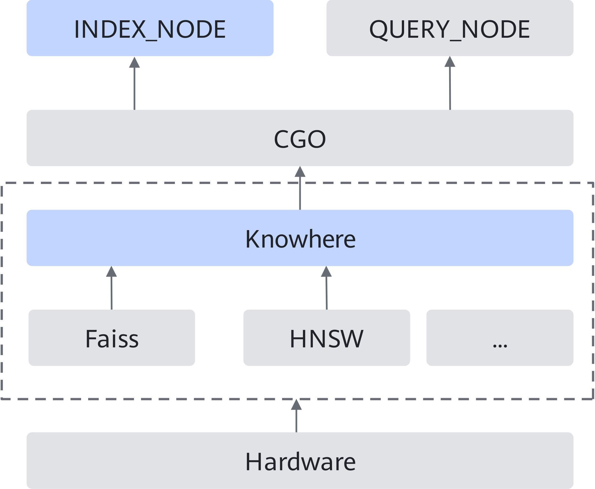
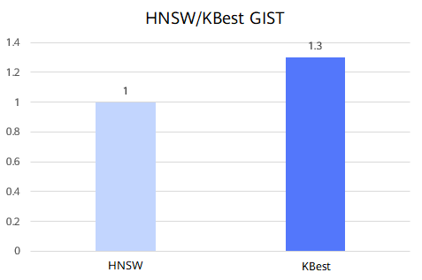

# Milvus KBest Optimization Feature Guide


### Feature Description<a name="EN-US_TOPIC_0000002515965278"></a>

#### Introduction<a name="EN-US_TOPIC_0000002547525093"></a>

Among all index algorithms supported by Milvus, the graph-based index algorithm is Hierarchical Navigable Small World (HNSW), which can perform quick query and achieve a high recall rate, but consumes a large amount of memory resources. To extend the graph-based index algorithm and enhance the query efficiency while ensuring a high recall rate, Kunpeng BoostKit proposes the Kunpeng Blazing-fast embedding similarity search thruster (KBest) algorithm.

KBest is an efficient, Kunpeng-developed graph search algorithm. It optimizes the performance and precision of the nearest neighbor search by using methods such as quantization and vector instructions, delivering search capabilities equivalent to the open-source Faiss HNSW algorithm.

This feature connects KBest to the open-source Milvus database through patch files to provide graph search functionality. For details, see [Installation and Usage Description](#installation-and-usage-description).


#### Principles<a name="EN-US_TOPIC_0000002516125190"></a>

Milvus verifies the index algorithm used before each query, which is done in INDEX_NODE. Only when the verification is successful, QUERY_NODE invokes the interface in the corresponding index algorithm to perform query-related operations. The operations on the preceding two nodes are implemented in Go. [**Figure 1**](#milvus-query-architecture) shows the Milvus query architecture.

**Figure 1** Milvus query architecture<a name="fig9581954683"></a><a id="milvus-query-architecture"></a>



Knowhere is the key component of index algorithms. This component is primarily implemented using C++. It links to core index algorithms (such as Faiss and HNSW) for invocation via CGO interfaces.

In conclusion, integrating the KBest algorithm into Milvus takes the following two steps:

1. Use Go to add the verification of the KBest algorithm to INDEX_NODE.
2. Use C++ to implement the connection to KBest in the Knowhere component.


### Verified Environments<a name="EN-US_TOPIC_0000002547525091"></a>

This document provides guidance based on the Kunpeng server and openEuler OS. Before performing operations, ensure that your hardware and software meet the requirements.


**Table 1** Hardware requirement<a id="hardware-requirement"></a>

|Item|Specifications|
|--|--|
|CPU|Kunpeng 920 series|


**Table 2** OS and software requirements<a id="os-and-software-requirements"></a>

|Item|Version|How to Obtain|
|--|--|--|
|OS|openEuler 22.03 LTS SP3|[Link](https://www.openeuler.org/en/download/archive/detail/?version=openEuler%252022.03%2520LTS%2520SP3)|
|OS|openEuler 22.03 LTS SP4|[Link](https://www.openeuler.org/en/download/archive/detail/?version=openEuler%252022.03%2520LTS%2520SP4)|
|Milvus|2.4.5|[Link](https://gitee.com/milvus-io/milvus/)|
|KBest|BoostKit-SRA_Recall-1.2.0.zip|Contact Huawei technical support.|
|Patch file|0001-milvus-add-kbest-kscann.patch|[Link](https://gitee.com/kunpeng_compute/milvus/releases/download/KunpengBoostKit25.1.RC1.kbest_kscann_index/0001-milvus-add-kbest-kscann.patch)|
|Patch file|0001-knowhere-add-kbest-kscann.patch|[Link](https://gitee.com/kunpeng_compute/milvus/releases/download/KunpengBoostKit25.1.RC1.kbest_kscann_index/0001-knowhere-add-kbest-kscann.patch)|

### Installation and Usage Description<a name="EN-US_TOPIC_0000002516125188" id="installation-and-usage-description"></a>

The KBest optimization feature for the Milvus database is provided in the form of patch files. Before using this optimization feature, install Kunpeng Recall Algorithm Library to ensure that the patch files can be compiled properly.

> **NOTE:**
>The open-source Milvus source code does not include the index-related component Knowhere. You need to pull the Knowhere source code during Milvus compilation and integrate it into the database. This feature is mainly used to optimize the index query and its patch files are added to the Knowhere source code. Therefore, Milvus needs to be compiled twice. The first compilation is to obtain the Knowhere source code. After the patch files are loaded into Knowhere, the second compilation is performed to enable the optimization feature.

1. Download Kunpeng Recall Algorithm Library to the home directory `~`, decompress the package, and install it.

    For details about how to obtain KBest, see [**Table 2**](#os-and-software-requirements).

    ```
    cd ~
    unzip BoostKit-SRA_Recall-1.2.0.zip
    rpm -ivh boostkit-sra_recall-1.2.0-1.aarch64.rpm
    ```

2. Use Git to clone Milvus, select version 2.4.5, and place it in the home directory `~`.

    For details about how to obtain Milvus, see [**Table 2**](#os-and-software-requirements). For details about how to compile and install Milvus, see [Milvus Installation Guide](https://www.hikunpeng.com/document/detail/en/kunpengdbs/ecosystemEnable/Milvus/kunpeng_milv_ins_42_001.html).

3. Obtain the patch files of the optimization feature and upload them to the home directory `~`.

    For details about how to obtain the patches, see [**Table 2**](#os-and-software-requirements).

4. Apply the optimization feature patches. If no command output is displayed, the patches are successfully applied.

    ```
    cd ~/milvus
    git apply --whitespace=nowarn < ~/0001-milvus-add-kbest-kscann.patch
    cd ~/milvus/cmake_build/thirdparty/knowhere/knowhere-src/
    git apply --whitespace=nowarn < ~/0001-knowhere-add-kbest-kscann.patch
    ```

5. Go back to the installation directory and perform full compilation on Milvus again to enable the optimization feature.

    > **NOTICE:**
    >The latest patches now support both the KBest and KScaNN algorithms. To integrate KScaNN, you need to first download its source code, introduce the relevant header files of related open-source code, and specify the relevant variables. For details, see [Milvus KScaNN Optimization Feature](https://www.hikunpeng.com/document/detail/en/kunpengdbs/appAccelFeatures/Milvuskscannop/kunpeng_kscann_tx_64_002.html). If you only want to enable the KBest algorithm, download the patches of an earlier version from the Gitee release page and delete the newly added parameters in the test tool.

    ```
    cd ~/milvus
    make milvus
    ```

6. Use the ANN-Benchmarks GIST dataset for tests and obtain the performance improvement before and after the optimization feature is enabled. See [**Figure 1**](#performance-comparison-before-and-after-optimization). Compared with the HNSW algorithm, the KBest algorithm can enable over 30% higher QPS for Milvus. For details about the test procedure, see [Milvus ANN-Benchmarks Test Guide](https://www.hikunpeng.com/document/detail/en/kunpengdbs/testguide/tstg/kunpeng_ann_marks_001.html).

    **Figure 1** Performance comparison before and after optimization<a name="fig792311685612"></a><a id="performance-comparison-before-and-after-optimization"></a>

    


### Configuration Description<a name="EN-US_TOPIC_0000002515965280"></a>

When creating a collection in Milvus, it is required to specify the vector dimension. The test tool loads the dimension when reading the dataset. However, dimensions supported by KBest are within a range, and the specified index types are case sensitive. [**Table 1**](#parameter-description) describes related configurations in the `config.yml` configuration file of ANN-Benchmarks.

> **NOTICE:**
>After creating an index in Milvus, you are advised to check the logs for error messages. Continuous error message loops indicate misconfigured parameters. Use these error details to diagnose and resolve issues, ensuring that queries run correctly.

**Table 1** Parameter description<a id="parameter-description"></a>

|Parameter|Description|Value Type and Range|Recommended Value|Configuration Principle|
|--|--|--|--|--|
|index_type|Index type specified during the test.|std::string; <code>KBEST</code>|<code>KBEST</code>|None.|
|metric_type|Distance measurement mode specified during the test.|const char*; <code>L2</code> (Euclidean distance) or <code>IP</code> (inner product)|None|This parameter is set by the dataset and does not require configuration.|
|dim|Feature dimension.|Integer; [1, 2999]|None|This parameter is set by the dataset and does not require configuration.|
|R|Number of neighboring nodes.|Integer; [11, 499]|<code>50</code>|This parameter affects the graph construction time and final index quality. The value <code>50</code> is recommended. If the value is too large, the construction time may be too long and the search performance may deteriorate. If the value is too small, the search precision may be affected.|
|L|Candidate node list during the graph construction.|Integer; [11, 1999]|<code>100</code>|This parameter affects the graph construction time and final index quality. The value <code>100</code> is recommended. If the value is too large, the construction time may be too long.|
|A|Angle threshold during the pruning of graph construction.|Integer; [10, 360]|<code>60</code>|Generally, the value <code>120</code> is used for the IP dataset, while <code>60</code> for the L2 dataset.|
|init_builder_type|Name of the built index algorithm.|const std::string&; <code>RNNDescent</code> or <code>NNDescent</code>|<code>RNNDescent</code>|Unless otherwise specified, <code>RNNDescent</code> is preferred.|
|consecutive|Block size.|Integer; [1, 31]|<code>20</code>|You may adjust the value as required.|
|efs|Size of the candidate node list during search.|Integer; [1, *Number_of_graph_construction_nodes*]|<code>400</code>|For small-scale datasets, the value ranges from 10 to 500. A larger <code>efs</code> value leads to higher search precision but lower search performance. It is advised to set <code>efs</code> to a smaller value when the precision meets the requirement.|
|num_search_thread|Number of threads during query.|Integer; [1, *Number_of_CPU_cores*]|<code>1</code>|You may adjust the value as required.|
|build_index_type|Index type during graph construction to select a neighboring node.|const std::string&; <code>HNSW</code>, <code>SSG</code>, <code>NSG</code>, or <code>TSDG</code>|<code>SSG</code>|Unless otherwise specified, <code>SSG</code> is preferred.|
|graph_opt_iter|Number of rounds for index self-iteration during graph construction.|Integer; [0, 30]|<code>6</code>|This parameter affects the graph construction time and final index quality. If the value is too large, the construction time may be too long.|
|reorder|Whether to perform reordering after graph construction|Boolean; <code>true</code> or <code>false</code>|<code>true</code>|This parameter affects the graph construction time and final index quality. You are advised to enable it.|
|adding_pref|Threshold for inserting a hyperparameter candidate set before search.|Integer; greater than 0|<code>52</code>|This parameter is used to limit the search path length and stop the search in advance. You may adjust the value as required.|
|patience|Search patience value.|Integer; greater than 0|<code>80</code>|This parameter is used to limit the search path length and stop the search in advance. You may adjust the value as required.|
|level|Quantization level. Range change allowed.|Integer; [0, 3]|<code>2</code>|Level 1 indicates SQ8 quantization, and level 2 indicates SQ4 quantization. Generally, the value <code>1</code> is used for the IP dataset, while <code>2</code> for the L2 dataset.|
