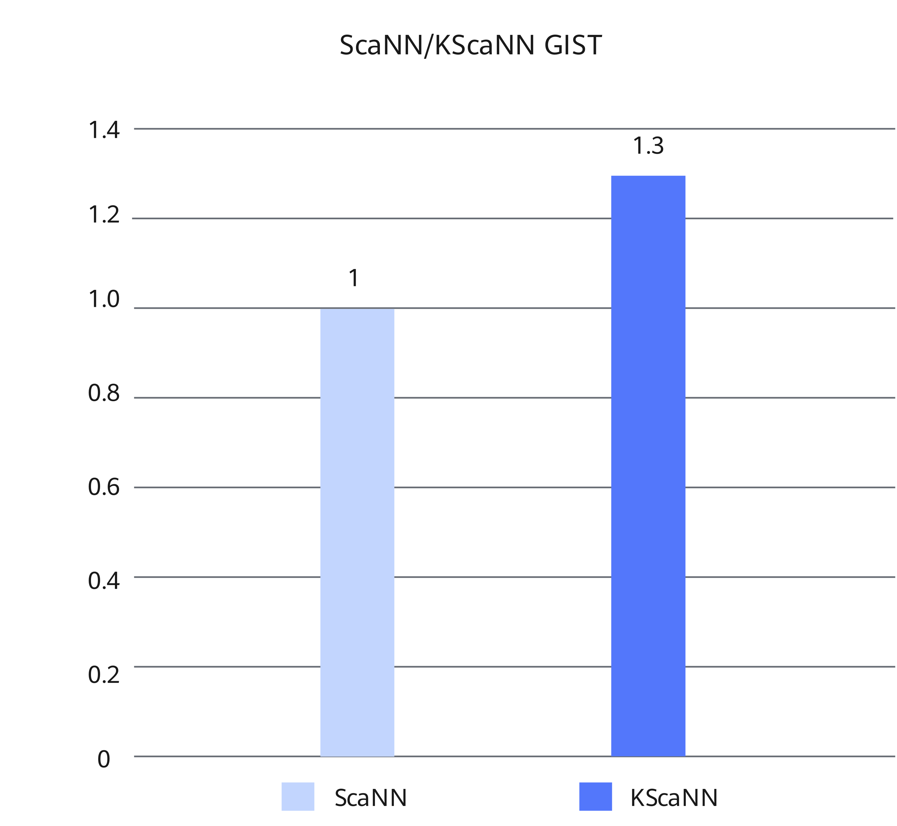

# Milvus KScaNN Optimization Feature Guide


### Feature Description<a name="EN-US_TOPIC_0000002515964590"></a>

#### Introduction<a name="EN-US_TOPIC_0000002515964592"></a>

The Milvus database supports Scalable Nearest Neighbors (ScaNN). ScaNN is an open-source algorithm library released by Google for efficient vector similarity retrieval. Based on the InVerted File Product Quantization (IVFPQ) principle, ScaNN uses 4-bit SIMD deep optimization on x86 and anisotropic quantization loss function optimization to achieve high retrieval performance. However, the ScaNN algorithm supported by Milvus is not from Google, but extended from IVFPQFastScan in Faiss. According to the performance curve provided by ANN-Benchmarks, the ScaNN algorithm outperforms Faiss-IVFPQFastScan and surpasses Milvus-HNSW in terms of precision. Interconnecting with Google's ScaNN algorithm can significantly improve the query performance.

However, due to the architectural differences of Kunpeng processors, the advantages in hardware-software collaboration of the ScaNN algorithm cannot be fully realized on Kunpeng servers. To address this, the Kunpeng Scalable Nearest Neighbors (KScaNN) optimization feature is introduced to enhance the performance of the ScaNN algorithm on these servers. KScaNN is a vector retrieval algorithm that utilizes inverted indexing and is deeply optimized for the Kunpeng processor architecture in terms of index layout, algorithm flow, and computation flow, with the goal of fully exploiting the processor capabilities. The KScaNN interfaces extend and modify the open-source ScaNN interfaces, offering comprehensive retrieval capabilities comparable to those of open-source ScaNN.

This feature applies KScaNN as patch files to the open-source Milvus database to provide graph index functionality. For details, see [Installation and Usage Description](#installation-and-usage-description).


#### Principles<a name="EN-US_TOPIC_0000002547524413"></a>

Before each query, Milvus verifies the index algorithm used. This process is performed in INDEX_NODE. Only when the verification is successful, QUERY_NODE invokes the interface in the corresponding index algorithm to perform query operations. The operations on the preceding two nodes are implemented in Go. [**Figure 1**](#milvus-query-architecture) shows the Milvus query architecture.

**Figure 1** Milvus query architecture<a name="fig16106299256"></a><a id="milvus-query-architecture"></a>


Knowhere is the key component of index algorithms. This component is primarily implemented using C++. It links to core index algorithms (such as Faiss and HNSW) for invocation via CGO interfaces.

In conclusion, integrating the KScaNN algorithm into Milvus takes the following two steps:

1. Use Go to add the verification of the KScaNN algorithm to INDEX_NODE.
2. Use C++ to implement the connection to KScaNN in the Knowhere component.


### Verified Environments<a name="EN-US_TOPIC_0000002547604411"></a>

This document provides guidance based on the Kunpeng server and openEuler OS. Before performing operations, ensure that your hardware and software meet the requirements.


**Table 1** Hardware requirement<a id="hardware-requirement"></a>

|Item|Specifications|
|--|--|
|CPU|Kunpeng 920 series|


**Table 2** OS and software requirements<a id="os-and-software-requirements"></a>

|Item|Version|How to Obtain|
|--|--|--|
|OS|openEuler 22.03 LTS SP3|[Link](https://repo.huaweicloud.com/openeuler/openEuler-22.03-LTS-SP3/ISO/aarch64/openEuler-22.03-LTS-SP3-everything-aarch64-dvd.iso)|
|OS|openEuler 22.03 LTS SP4|[Link](https://repo.huaweicloud.com/openeuler/openEuler-22.03-LTS-SP4/ISO/aarch64/openEuler-22.03-LTS-SP4-everything-aarch64-dvd.iso)|
|Milvus|2.4.5|[Link](https://gitee.com/milvus-io/milvus/)|
|KSL|BoostKit-ksl_2.4.0.zip|[Link](https://www.hikunpeng.com/en/developer/boostkit/library/system?subtab=AVX2KI&version=2.1.0)|
|KScaNN|BoostKit-SRA_Recall-1.2.0.zip|Contact Huawei technical support.|
|Patch file|0001-milvus-add-kbest-kscann.patch|[Link](https://gitee.com/kunpeng_compute/milvus/releases/download/KunpengBoostKit25.1.RC1.kbest_kscann_index/0001-milvus-add-kbest-kscann.patch)|
|Patch file|0001-knowhere-add-kbest-kscann.patch|[Link](https://gitee.com/kunpeng_compute/milvus/releases/download/KunpengBoostKit25.1.RC1.kbest_kscann_index/0001-knowhere-add-kbest-kscann.patch)|


### Installation and Usage Description<a name="ZH-CN_TOPIC_0000002547524415"></a>

The KScaNN optimization feature for the Milvus database is provided as patch files. Before using this feature, install Kunpeng Recall Algorithm Library to ensure that the patch files can be compiled.

> **NOTE:**
>The open-source Milvus source code does not include the Knowhere component. You need to pull the Knowhere source code during Milvus compilation and integrate it into the database. This feature is mainly used to optimize the index query and its patch files are added to the Knowhere source code. Therefore, Milvus needs to be compiled twice: The first compilation is to obtain the Knowhere source code, and the second compilation is to enable the optimization feature after the patch files are applied.

1. Download Kunpeng Recall Algorithm Library to the home directory `~`, decompress the package, and install it.

    For details about how to obtain KScaNN, see [**Table 2**](#os-and-software-requirements).

    ```
    cd ~
    unzip BoostKit-SRA_Recall-1.2.0.zip
    rpm -ivh boostkit-sra_recall-1.2.0-1.aarch64.rpm
    ```

2. Download KSL to the home directory `~`, decompress the package, and install it.

    For details about how to obtain KSL, see [**Table 2**](#os-and-software-requirements).

    ```
    cd ~
    unzip BoostKit-ksl_2.4.0.zip
    rpm -ivh boostkit-ksl-2.4.0-1.aarch64.rpm
    ```

3. Use Git to clone Milvus, select version 2.4.5, and place it in the home directory `~`.

    For details about how to obtain Milvus, see [**Table 2**](#os-and-software-requirements). For details about how to compile and install Milvus, see [Milvus Installation Guide](https://www.hikunpeng.com/document/detail/en/kunpengdbs/ecosystemEnable/Milvus/kunpeng_milv_ins_42_001.html).

4. Obtain the patch files of the optimization feature and upload them to the home directory `~`.

    For details about how to obtain the patches, see [**Table 2**](#os-and-software-requirements).

5. Apply the optimization feature patches. If no command output is displayed, the patches are successfully applied. If the content of the `~/milvus/internal/core/conanfile.py` file is modified during Milvus compilation, you can manually add the content after applying the patches.

    ```
    cd ~/milvus
    git status
    git restore .
    git apply --whitespace=nowarn < ~/0001-milvus-add-kbest-kscann.patch
    cd ~/milvus/cmake_build/thirdparty/knowhere/knowhere-src/
    git apply --whitespace=nowarn < ~/0001-knowhere-add-kbest-kscann.patch
    ```

6. <a name="li13802146193717" id="li13802146193717"></a>Kunpeng Recall Algorithm Library provides only the dynamic library file of KScaNN. Therefore, you need to generate the dynamic library file `libscann_cc.so` of OpenScann. The procedure is as follows. For details, see [Using SRA_Recall](https://www.hikunpeng.com/document/detail/en/SRA/accelFeatures/recall/kunpengsra_recall_16_0007.html) in the *Kunpeng Recall Algorithm Library Developer Guide*.
    1. Install the dependency packages.

        ```
        yum install python python3-pip python3-devel java-11-openjdk java-11-openjdk-devel rsync libomp hdf5 hdf5-devel gtest-devel libuuid-devel
        yum install gcc-toolset-12*
        ```

    2. Install the dependency software Bazel 5.3.0.

        ```
        cd ~
        wget https://github.com/bazelbuild/bazel/releases/download/5.3.0/bazel-5.3.0-dist.zip --no-check-certificate
        unzip bazel-5.3.0-dist.zip -d bazel-5.3.0
        cd bazel-5.3.0
        env EXTRA_BAZEL_ARGS="--tool_java_runtime_version=local_jdk" bash ./compile.sh
        export PATH=~/bazel-5.3.0/output:$PATH
        ```

    3. Download and compile OpenScann.

        ```
        export PATH=/opt/openEuler/gcc-toolset-12/root/usr/bin/:$PATH
        export LD_LIBRARY_PATH=/opt/openEuler/gcc-toolset-12/root/usr/lib64/:$LD_LIBRARY_PATH
        
        cd ~
        wget https://gitee.com/openeuler/sra_scann_adapter/repository/archive/v1.1.0.zip --no-check-certificate 
        unzip v1.1.0.zip -d OpenScann
        cd OpenScann/sra_scann_adapter-v1.1.0
        ```

        Activate the Python virtual environment and compile `libscann_cc.so`.

        - Kunpeng 920

            ```
            conda activate milvus
            sh project.sh -ah
            ```

        - New Kunpeng 920 processor model

            ```
            conda activate milvus
            sh project.sh -ag
            ```

            > **NOTICE:**
            >If openEuler 22.03 LTS SP4 is used, an lto-wrapper error will be reported if GCC 12 downloaded using Yum is used to compile `libscann_cc.so`. You can change the Yum repository proxy in the `/etc/yum.repos.d/openEuler.repo` file to the Yum repository proxy of openEuler 22.03 LTS SP3 to avoid this issue.

    4. Specify the header file path and dynamic library file path of OpenScann.

        ```
        export OPEN_SCANN_LIB=~/OpenScann/kscann/scann/libscann_cc.so
        export OPEN_SCANN_INCLUDE=~/OpenScann/kscann/scann/
        ```

        > **NOTICE:**
        >The patch package reads the path specified by `OPEN_SCANN_INCLUDE` and runs a Python file in the directory. Therefore, the last slash (/) in the path cannot be deleted.

    5. Switch GCC 12 to GCC 10.3.1 and continue the compilation.

        > **NOTE:**
        >GCC 12 is used to compile `libscann_cc.so` in [6](#li13802146193717) only. In subsequent Milvus compilation, use GCC 10.3.1.

7. Install environment dependencies of Milvus-KScaNN.
    1. Install the dependency software Eigen 3.3.7.

        ```
        git clone https://gitlab.com/libeigen/eigen.git
        cd eigen
        git checkout 33d0937c6bdf5ec999939fb17f2a553183d14a74
        mkdir build && cd build
        cmake .. -DCMAKE_INSTALL_PREFIX=/usr/local/eigen-3.3.7
        make -sj && make install
        ```

    2. Activate the Python virtual environment and install Python dependencies.

        ```
        conda activate milvus
        pip install treelite==4.2.1
        pip install tl2cgen
        conda install pybind11
        ```

8. Go back to the installation directory and perform full compilation on Milvus again to enable the optimization feature.

    ```
    cd ~/milvus
    make milvus
    ```

9. Use the ANN-Benchmarks GIST dataset for tests and obtain the performance improvement before and after the optimization feature is enabled. See [**Figure 1**](#performance-comparison-before-and-after-optimization). Compared with the ScaNN algorithm, the KScaNN algorithm can enable over 30% higher QPS for Milvus. For details about the test procedure, see [Milvus ANN-Benchmarks Test Guide](https://www.hikunpeng.com/document/detail/en/kunpengdbs/testguide/tstg/kunpeng_ann_marks_001.html).

    **Figure 1** Performance comparison before and after optimization<a name="fig20889279511"></a><a id="performance-comparison-before-and-after-optimization"></a>
    
    


### Configuration Description<a name="EN-US_TOPIC_0000002547604413"></a>

When creating a Milvus collection, you need to specify the dimension of vectors. When the test tool reads the dataset, it loads the dimension. Note that the specified index type is case sensitive. [**Table 1**](#parameter-description) describes related configurations in the `config.yml` configuration file of ANN-Benchmarks.

> **NOTICE:**
>You are advised to check log information after starting Milvus and creating indexes. If Milvus repeatedly prints error information in logs, parameter configurations are incorrect. Locate and rectify the faults based on the error information to ensure that queries can be correctly executed.

KScaNN does not provide public APIs; it is an intrusive modification of the open-source ScaNN algorithm with extensions to its open-source interfaces. Therefore, no comprehensive parameter restrictions are implemented on the internal APIs of KScaNN. After Milvus is interconnected with KScaNN, the parameters of open-source APIs are not restricted. You can make adjustments according to actual requirements to achieve better performance.

**Table 1** Parameter description<a id="parameter-description"></a>

|Parameter|Description|Value Type and Range|Recommended Value|Configuration Principle|
|--|--|--|--|--|
|index_type|Index type specified during the test.|std::string; <code>KSCANN</code>|<code>KSCANN</code>|None.|
|metric_type|Distance measurement mode specified during the test.|const char*; <code>L2</code> (Euclidean distance) or <code>IP</code> (inner product)|None|This parameter is set by the dataset and does not require configuration.|
|dim|Feature dimension.|Integer|None|This parameter is set by the dataset and does not require configuration.|
|n_leaves|Number of leaf nodes.|Integer|<code>2000</code>|This parameter affects the graph construction time and final index quality. If the value is too large, the construction time may be too long and the search performance may deteriorate. If the value is too small, the search precision may be affected.|
|dims_per_block|Number of dimensions that form a sub-vector block in the product quantization (PQ) phase during graph construction.|Integer|<code>4</code>|The value <code>4</code> is recommended. You may adjust the value as required.|
|avq_threshold|AVQ threshold during graph construction.|Float|None|This parameter affects the pruning policy. Generally, the value <code>0.2</code> is used for the IP dataset. For the L2 dataset, this parameter is left empty.|
|soar_lambda|Orthogonality configuration. This parameter takes effect only for the IP dataset.|Float; greater than 0|<code>-1</code>|<code>-1</code> indicates that this parameter is not used. When using the IP dataset, you may adjust the value as required.|
|overretrieve_factor|Used together with <code>soar_lambda</code> to specify the over-retrieval factor. This parameter takes effect only for the IP dataset.|Float; [1, 2]|<code>-1</code>|<code>-1</code> indicates that this parameter is not used. When using the IP dataset, you may adjust the value as required.|
|train_thread|Number of threads during graph construction.|Integer|Number of CPU cores|Set this parameter to the number of CPU cores unless otherwise specified.|
|nprobe|Number of subspaces that a complex query will search within.|Integer; [1, <code>n_leaves</code>]|<code>250</code>|You may adjust the value as required.|
|reorder|Number of results saved before reordering.|Integer; [*k*, *Number_of_records_in_the_database*]|<code>900</code>|*k* indicates the number of final results returned. You may adjust the value as required.|
|adp_threshold|Adaptive truncation threshold during query. Reserved parameter for future use, which is not used in the current version.|Float; [0, 0.8]|<code>0</code>|You may adjust the value as required.|
|adp_refined|Number of subspaces that a simple query will search within. Reserved parameter for future use, which is not used in the current version.|Integer; [0, <code>nprobe</code>]|<code>0</code>|The typical value is <code>0</code>. However, the value range is [1, <code>nprobe</code>] for search and recommendation scenarios. In this document, the value range is [0, <code>nprobe</code>]. You may adjust the value as required.|
|num_thread|Number of threads during query.|Integer; greater than or equal to 1|<code>1</code>|Set it to <code>1</code> unless otherwise specified.|
|batch_size|Size of the preferred batch during automatic parallel batching.|Integer; greater than or equal to 1|<code>1</code>|Set it to <code>1</code> unless otherwise specified.|
