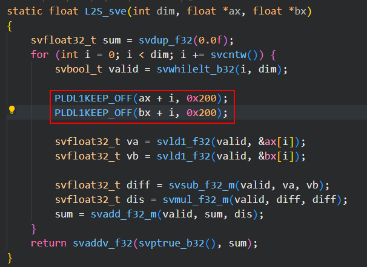
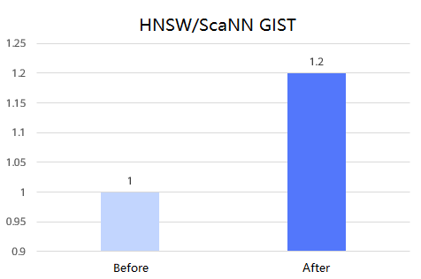

# Milvus Vector Instruction Optimization Feature Guide

## Feature Description<a name="EN-US_TOPIC_0000002547526621"></a>

This document describes the principles, installation, and usage of the vector instruction optimization feature of the Milvus database.

Milvus is an industry-leading vector database with high performance and scalability. It provides powerful data modeling functions. When the Hierarchical Navigable Small World (HNSW) or Scalable Nearest Neighbors (ScaNN) algorithm is used to test the GIST dataset on Milvus, it is found that the hotspot function for calculating the similarity between two vectors accounts for nearly 90% of the CPU usage. Therefore, optimizing this hotspot function is expected to greatly improve the database performance. For such operations that involve a large quantity of loops and simple mathematical calculations, using the Scalable Vector Extension (SVE) instructions and the prefetch (PF) can be effective in acceleration.

- SVE is an instruction extension developed by Arm to improve the performance of computing-intensive applications using vectorization. Different from the NEON instructions, SVE is scalable in that the length of the vector register is not limited by a fixed length and can be scaled as required. SVE also introduces vector predicate operations, allowing some elements to be computed in the same vector operation. Such flexibility improves code portability and efficiency.
- PF is a technology used to enhance the computer system performance by reducing the idle time of a processor when it waits for memory data. By loading data to the cache in advance, PE can significantly lower the memory access latency and improve the overall system performance.

SVE and PF together implement the vector instruction optimization feature of the Milvus database. The Milvus-HNSW algorithm improves queries per second (QPS) performance by 20% on the ANN-Benchmarks GIST dataset with a recall value greater than 0.99 and the configuration of 16 vCPUs and 64 GB memory. The Milvus-ScaNN algorithm also improves QPS performance by 20% on the ANN-Benchmarks GIST dataset with a recall value greater than 0.95.

## Environment Requirements<a name="EN-US_TOPIC_0000002516126710"></a>

This document provides guidance based on the Kunpeng server and openEuler OS. Before performing operations, ensure that your hardware and software meet the requirements.


**Table 1** Hardware requirement<a id="hardware-requirement"></a>

|Item|Specifications|
|--|--|
|CPU|New Kunpeng 920 processor model|


**Table 2** OS and software requirements<a id="os-and-software-requirements"></a>

|Item|Version|How to Obtain|
|--|--|--|
|OS|openEuler 22.03 LTS SP3|[Link](https://www.openeuler.org/en/download/archive/detail/?version=openEuler%252022.03%2520LTS%2520SP3)|
|OS|openEuler 22.03 LTS SP4|[Link](https://www.openeuler.org/en/download/archive/detail/?version=openEuler%252022.03%2520LTS%2520SP4)|
|Milvus|2.4.5|[Link](https://gitee.com/milvus-io/milvus/)|
|GCC|10.3.1|Delivered with openEuler 22.03 LTS SP3 and openEuler 22.03 LTS SP4.|
|Patch file|0001-hnsw-scann-sve-pf.patch|[Link](https://gitee.com/kunpeng_compute/milvus/releases/download/KunpengBoostKit25.0.RC1.hnsw_scann_sve_pf/0001-hnsw-scann-sve-pf.patch)|


## Configuration Before Installation<a name="EN-US_TOPIC_0000002515966788" id="configuration-before-installation"></a>

The optimization feature has been written into the patch file. After the patch file is applied to the source code, the feature is ready for use.

**Using SVE to Accelerate Vector Computing<a name="section69055571702"></a>**

**Prerequisites**

The CPU supports SVE instruction optimization.

**Check Method**

Run the following command to check whether the CPU supports SVE instruction optimization:

```
lscpu
```

If the `Flags` line in the command output contains `sve`, the CPU supports SVE instruction optimization.

```
Architecture:           aarch64
  CPU op-mode(s):       64-bit
  Byte Order:           Little Endian
CPU(s):                 320
  On-line CPU(s) list:  0-319
Vendor ID:              HiSilicon
  BIOS Vendor ID:       HiSilicon
  BIOS Model name:      Kunpeng 920
  Model:                0
  Thread(s) per core:   2
  Core(s) per socket:   80
  Socket(s):            2
  Stepping:             0x0
  Frequency boost:      disabled
  CPU max MHz:          3000.0000
  CPU min MHz:          400.0000
  BogoMIPS:             200.00
  Flags:                fp asimd evtstrm aes pmull sha1 sha2 crc32 atomics fphp asimdhp cpuid asimdrdm jscvt fcma lrcpc dcpop sha3 sm3 sm4 asimddp sha512 sve asimdfhm dit uscat ilrcpc fla
                        gm ssbs sb paca pacg dcpodp flagm2 frint svei8mm svef32mm svef64mm svebf16 i8mm bf16 dgh rng ecv
Caches (sum of all):
  L1d:                  10 MiB (160 instances)
  L1i:                  10 MiB (160 instances)
  L2:                   200 MiB (160 instances)
  L3:                   280 MiB (4 instances)
```

**Compilation Options**

During GCC compilation, the `-march` compilation option specifies the Arm architecture version and the extended instruction set. In this patch, SVE is specified through the following compilation options:

```
-march=armv8-a+sve -msve-vector-bits=256
```

The former indicates that the SVE instruction is used, and the latter specifies the number of bits of the SVE vector length.

**Using PF to Accelerate Data Processing<a name="section1820132215314"></a>**

In the cases of frequent cyclic operations, parallel computing, and high cache miss rate, PF can be used to accelerate data processing and improve system performance.

**Hardware Prefetch**

Hardware prefetch is to read instructions and data addresses to the cache in advance by tracing the changes of instructions and data addresses. You are advised to enable the prefetch function in the BIOS.

1. Restart the server and enter the BIOS.
2. In the BIOS, choose `Advanced` > `MISC Config` and press `Enter`.
3. Set `CPU Prefetching Configuration` to `Enabled`, and press `F10`.

**Software Prefetch**

In the Arm architecture, the Prefetch Memory (PRFM) instruction can be used to prefetch data. The prefetch instruction loads data to the cache, but the data is not immediately used by the processor. The prefetched data is usually stored in the L1 data cache. If the L1 cache is full, data may be stored in the L2 cache or L3 cache (if any). In addition, the prefetching effect may be further optimized by adjusting the prefetch step.

The following describes the implementation of the prefetch instruction in C++.

```
#define PLDL1KEEP_OFF(ptr, off) __asm__ volatile("prfm PLDL1KEEP, [%0, #(%1)]"::"r"(ptr), "i"(off):)
```

In this feature, the prefetch instruction is added before the SVE load instruction to combine the two optimization methods.




## Feature Installation and Usage<a name="EN-US_TOPIC_0000002547526623"></a>

The acceleration feature of the Milvus database is mainly applied to the HNSW and ScaNN index algorithms. The optimization feature is provided in the form of a patch file. After Milvus is compiled, apply the patch file to the Knowhere source code, and then perform compilation again to use the optimization feature. This patch is developed for Milvus 2.4.5.

> **NOTE:**
>The open-source Milvus source code does not include the index-related component Knowhere. You need to pull the Knowhere source code during Milvus compilation and integrate it into the database. This feature is used to optimize the index query and its patch file is added to the Knowhere source code. Therefore, Milvus needs to be compiled twice. The first compilation is to obtain the Knowhere source code. After the patch file is loaded into Knowhere, the second compilation is performed to enable the optimization feature.
>In addition, you are advised to enable the BIOS prefetch function in advance, which can be combined with the software prefetch in the patch file. Through modifying the prefetch step, the performance can be further improved. For details, see [Configuration Before Installation](#configuration-before-installation).

1. Download the Milvus installation package and save it to the home directory `~`. Compile and install Milvus by following instructions in [Milvus Database Installation Guide](https://www.hikunpeng.com/document/detail/en/kunpengdbs/ecosystemEnable/Milvus/kunpeng_milv_ins_42_001.html).

    For details about how to obtain the package, see [**Table 2**](#os-and-software-requirements).

2. Obtain the patch file `0001-hnsw-scann-sve-pf.patch` for the acceleration optimization feature and upload it to the home directory.

    For details about how to obtain the patch, see [**Table 2**](#os-and-software-requirements).

3. Go to the `./cmake_build/thirdparty/knowhere/knowhere-src` directory in the installation directory and apply the acceleration optimization feature patch. If no command output is displayed, the patch is successfully applied.

    ```
    cd cmake_build/thirdparty/knowhere/knowhere-src
    git apply --whitespace=nowarn < ~/0001-hnsw-scann-sve-pf.patch
    ```

4. In the `./cmake_build/thirdparty/knowhere/knowhere-build` directory, compile the Knowhere component and use the optimization feature.

    ```
    cd ../knowhere-build
    make -sj
    cp -r ../../../lib/libknowhere.so ../../../../internal/core/output/lib64/
    ```

5. Check whether the acceleration feature is enabled.

    ```
    strings ~/milvus/internal/core/output/lib64/libknowhere.so | grep sve
    ```

    If SVE-related information is returned, the acceleration feature is enabled successfully.

    ```
    GNU C++17 10.3.1 -march=armv8-a+sve -mlittle-endian -mabi=lp64 -g -O3 -O3 -std=gnu++17 -std=gnu++17 -std=gnu++17 -fopenmp -fPIC
    ```

6. Use the ANN-Benchmarks GIST dataset for tests and obtain the performance improvement before and after the optimization feature is enabled. See [**Figure 1**](#performance-comparison-before-and-after-optimization). After the Milvus vector instruction optimization feature is enabled, the QPS can be improved by 20% for Milvus. For details about the test procedure, see [Milvus ANN-Benchmarks Test Guide](https://www.hikunpeng.com/document/detail/en/kunpengdbs/testguide/tstg/kunpeng_ann_marks_001.html).

    **Figure 1** Performance comparison before and after optimization<a name="fig78861413814"></a><a id="performance-comparison-before-and-after-optimization"></a><br>
    


## Acronyms and Abbreviations<a name="EN-US_TOPIC_0000002515966786"></a>

|Acronym/Abbreviation|Full Spelling|
|--|--|
|SVE|Scalable Vector Extension|
|NEON|Advanced SIMD (Single Instruction Multiple Data)|
|PF|Prefetch|
|QPS|queries per second|
