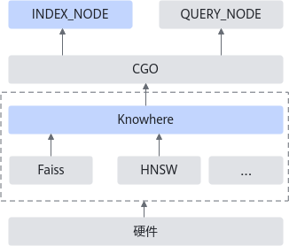
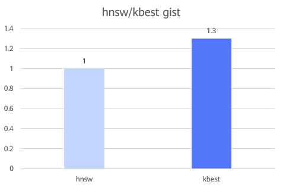

# Milvus KBest优化 特性指南<a name="ZH-CN_TOPIC_0000002552349477"></a>


### 特性描述<a name="ZH-CN_TOPIC_0000002515965278"></a>

#### 简介<a name="ZH-CN_TOPIC_0000002547525093"></a>

在Milvus支持的所有索引算法中，基于图的索引算法是HNSW（Hierarchical Navigable Small World），它能进行快速查询，取得较高的召回率，但是消耗的内存资源较大。为了扩展基于图的索引算法，在保证高召回率的前提下，尽可能加速查询效率，鲲鹏BoostKit提出了KBest（Kunpeng Blazing-fast embedding similarity search thruster）鲲鹏图检索算法。

KBest是鲲鹏自研的高效的图索引算法，通过量化、向量指令等方法优化了最近邻搜索的性能和精度，提供了对标开源Faiss HNSW算法的检索能力。

本特性以patch文件的方式实现，将KBest算法接入开源的Milvus数据库中，无缝使用新的图索引算法。具体使用方法参考[安装和使用说明](#安装和使用说明)。


#### 原理描述<a name="ZH-CN_TOPIC_0000002516125190"></a>

Milvus在每次进行查询前，都会对使用的索引算法进行验证，这一切都在INDEX\_NODE中完成。只有当验证通过，QUERY\_NODE才会调用对应索引算法中的接口，进行查询的一系列操作。以上两个节点的操作都是用Go语言实现。Milvus的整体查询结构如下[**图 1** Milvus整体查询架构](#Milvus整体查询架构)所示。

**图 1** Milvus整体查询架构<a name="fig9581954683"></a><a id="Milvus整体查询架构"></a>



索引算法的关键组件叫做Knowhere，主要用C++实现，会链接核心的索引算法（如Faiss或HNSW等）和CGO接口，进行调用。

综上所述，引入KBest算法，需要在两个方面进行处理。

1. 在INDEX\_NODE中添加对于KBest算法的验证，该部分用Go语言实现。
2. 在Knowhere组件中，引入对于KBest的对接实现，该部分用C++语言实现。


### 已验证环境<a name="ZH-CN_TOPIC_0000002547525091"></a>

本文基于鲲鹏服务器和openEuler操作系统提供指导，在正式操作前请确保软硬件均满足要求。


**表 1** 硬件要求<a id="硬件要求"></a>

|项目|规格|
|--|--|
|CPU|鲲鹏920系列处理器|


**表 2** 操作系统和软件要求<a id="操作系统和软件要求"></a>

|项目|版本|获取地址|
|--|--|--|
|操作系统|openEuler 22.03 LTS SP3|[获取链接](https://www.openeuler.org/zh/download/archive/detail/?version=openEuler%252022.03%2520LTS%2520SP3)|
|操作系统|openEuler 22.03 LTS SP4|[获取链接](https://www.openeuler.org/zh/download/archive/detail/?version=openEuler%252022.03%2520LTS%2520SP4)|
|Milvus|2.4.5|[获取链接](https://gitee.com/milvus-io/milvus/)|
|KBest|BoostKit-SRA_Recall-1.2.0.zip|单击[获取链接](https://www.hikunpeng.com/boostkit/sra#KBest)，进入“搜推广加速套件>鲲鹏召回算法库>KBest”，单击“软件包下载”，根据提示下载“BoostKit-SRA_Recall-1.2.0.zip”。本特性仅使用了鲲鹏召回算法库“BoostKit-SRA_Recall-1.2.0.zip”中的KBest算法进行优化。|
|补丁文件|0001-milvus-add-kbest-kscann.patch|[获取链接](https://gitee.com/kunpeng_compute/milvus/releases/download/KunpengBoostKit25.1.RC1.kbest_kscann_index/0001-milvus-add-kbest-kscann.patch)|
|补丁文件|0001-knowhere-add-kbest-kscann.patch|[获取链接](https://gitee.com/kunpeng_compute/milvus/releases/download/KunpengBoostKit25.1.RC1.kbest_kscann_index/0001-knowhere-add-kbest-kscann.patch)|

### 安装和使用说明<a name="ZH-CN_TOPIC_0000002516125188" id="安装和使用说明"></a>

针对Milvus数据库的KBest优化特性以patch文件形式提供，在应用这个优化特性之前，还需要先安装鲲鹏召回算法库，保证patch文件正常通过编译。

> **说明：** 
>开源Milvus源码不包括索引相关的组件Knowhere，需要在编译过程中拉取Knowhere的源码并进行对接。本次优化特性主要应用于索引查询，补丁文件主要会添加到Knowhere源码中。所以整体使用过程需要编译Milvus两次，一次编译拉取Knowhere的源码，在打入patch文件后进行第二次编译，用来使能优化特性。

1. 下载鲲鹏召回算法库放在主目录“\~”下，解压并安装。

    获取路径请参见[**表 2** 操作系统和软件要求](#操作系统和软件要求)的KBest获取路径，执行以下命令解压和安装。

    ```
    cd ~
    unzip BoostKit-SRA_Recall-1.2.0.zip
    rpm -ivh boostkit-sra_recall-1.2.0-1.aarch64.rpm
    ```

2. 使用git克隆Milvus并切换到2.4.5版本，放在主目录“\~”下。

    获取路径请参见[**表 2** 操作系统和软件要求](#操作系统和软件要求)，参见《[Milvus 安装指南](https://www.hikunpeng.com/document/detail/zh/kunpengdbs/ecosystemEnable/Milvus/kunpeng_milv_ins_42_001.html)》完成Milvus的编译安装。

3. 获取优化特性的补丁文件，将其上传到主目录“\~”下。

    获取路径请参见[**表 2** 操作系统和软件要求](#操作系统和软件要求)。

4. 执行以下命令，合入优化特性。没有输出则说明合入成功。

    ```
    cd ~/milvus
    git apply --whitespace=nowarn < ~/0001-milvus-add-kbest-kscann.patch
    cd ~/milvus/cmake_build/thirdparty/knowhere/knowhere-src/
    git apply --whitespace=nowarn < ~/0001-knowhere-add-kbest-kscann.patch
    ```

5. 回到安装目录下，再次全量编译Milvus，以使用优化特性。

    > **须知：** 
    >由于最新patch文件进行了更新，里面包含了KBest和KScaNN两个算法的内容，引入KScaNN相关开源代码的头文件，需要提前下载好KScaNN相关源码，指定相关变量。具体操作参考《[Milvus KScaNN优化 特性指南](https://www.hikunpeng.com/document/detail/zh/kunpengdbs/appAccelFeatures/Milvuskscannop/kunpeng_kscann_tx_64_002.html)》。若是仅想使能旧有KBest算法，可以在gitee发布页面下载旧版patch，同时在测试工具中，删除新增的参数。

    ```
    cd ~/milvus
    make milvus
    ```

6. 通过ann-benchmarks gist数据集进行测试，可以得到使用加速优化特性前后的性能提升效果，如[**图 1** 优化特性使能前后性能对比](#优化特性使能前后性能对比)所示。即采用鲲鹏召回算法KBest，对比hnsw算法，将Milvus查询性能（QPS）提升30%以上。详细测试步骤请参见《[Milvus ann-benchmarks 测试指导](https://www.hikunpeng.com/document/detail/zh/kunpengdbs/testguide/tstg/kunpeng_ann_marks_001.html)》。

    **图 1** 优化特性使能前后性能对比<a name="fig792311685612"></a><a id="优化特性使能前后性能对比"></a>

    


### 配置说明<a name="ZH-CN_TOPIC_0000002515965280"></a>

Milvus在创建Collection的时候需要指定向量的维度，测试工具会在读取数据集的时候将维度加载进来，但是KBest支持的维度是有范围的，而且指定的索引类型也是严格规定必须区分大小写。现将测试工具ann\_benchmarks的config.yml配置文件所有涉及的配置说明如[**表 1** 参数配置说明](#参数配置说明)所示。

> **须知：** 
>建议用户在Milvus启动创建索引操作之后检查日志信息，若Milvus一直在日志里循环打印报错信息，表示配置参数错误，请根据报错信息进行问题定位，保证查询的正确进行。

**表 1** 参数配置说明<a id="参数配置说明"></a>

|参数名称|参数描述|类型范围|建议值|配置原则|
|--|--|--|--|--|
|index_type|测试时指定的索引类型|std::string，“KBEST”|KBEST|无。|
|metric_type|测试时指定的距离度量方式|const char*，“L2”：欧氏距离“IP”：内积|无|数据集自带，无需手动配置。|
|dim|特征维度|int，[1,2999]|无|数据集自带，无需手动配置。|
|R|邻居节点数|int，[11,499]|[50]|该参数影响图构建耗时和最终索引质量，一般推荐使用50，过大可能会导致构建耗时过长以及搜索性能下降，过小则会影响检索精度。|
|L|构图时的候选节点列表|int，[11,1999]|[100]|该参数影响图构建耗时和最终索引质量，一般推荐使用100，过大可能会导致构建耗时过长。|
|A|构图剪枝时的角度阈值|int，[10,360]|[60]|对于IP数据集，一般使用120，L2数据集一般使用60。|
|init_builder_type|构建的索引算法名称|const std::string&，“RNNDescent”“NNDescent”|"RNNDescent"|无特殊情况，优先使用RNNDescent。|
|consecutive|块大小|int，[1,31]|[20]|根据实际情况自行调整。|
|efs|检索时的候选节点列表大小|int，[1,构图节点数]|[400]|对于小规模数据集，一般在10~500左右。更大的efs会带来更高的检索精度，但是检索性能也会降低。建议在精度达标情况下efs取较小值。|
|num_search_thread|查询时线程数|int，[1,cpu核数]|[1]|根据实际情况自行调整。|
|build_index_type|构图时的索引类型，选择邻居节点的策略|const std::string &"HNSW""SSG""NSG""TSDG"|"SSG"|无特殊情况，优先使用"SSG"。|
|graph_opt_iter|构图时图索引自我迭代的轮数|int，[0, 30]|[6]|该参数影响图构建耗时和最终索引质量，过大可能会导致构建耗时过长。|
|reorder|构图之后是否重排|bool，true或false|[true]|该参数影响图构建耗时和最终索引质量，建议开启。|
|adding_pref|检索前超参候选集插入阈值|int，大于0|[52]|该参数用来限制搜索路径长度，提前停止检索。数值根据实际情况进行调整。|
|patience|检索耐心值|int，大于0|[80]|该参数用来限制搜索路径长度，提前停止检索。数值根据实际情况进行调整。|
|level|控制量化的等级。支持范围改变|int，[0,3]|[2]|level 1代表SQ8量化，level 2代表SQ4量化。对于IP数据集，一般使用1，L2数据集使用2。|


