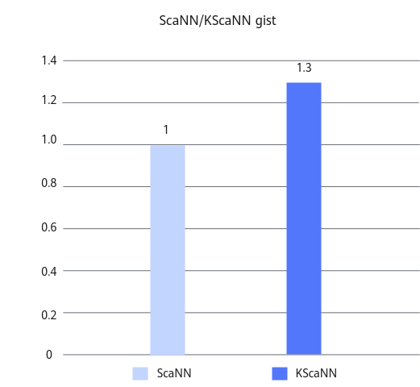

# Milvus KScaNN优化 特性指南


## 特性描述<a name="ZH-CN_TOPIC_0000002515964590"></a>

### 简介<a name="ZH-CN_TOPIC_0000002515964592"></a>

Milvus数据库支持ScaNN索引算法。ScaNN（Scalable Nearest Neighbors）是由Google发布的高效向量相似性检索开源算法库，基于IVFPQ原理，通过x86上的4bit SIMD深度优化和各向异性量化损失函数优化，实现了极高的检索性能。然而，Milvus中支持的ScaNN算法并非源自Google，而是从Faiss中的IVFPQFastScan扩展而来。根据Ann-benchmarks提供的性能曲线显示，ScaNN算法优于Faiss-IVFPQFastScan，在高精度方面也优于Milvus-HNSW。对接Google的ScaNN算法可以显著提升查询性能。

然而，由于鲲鹏芯片的架构差异，ScaNN算法的软硬件协同优势在鲲鹏服务器上无法完全发挥，因此推出KScaNN优化特性，用于优化ScaNN类算法在鲲鹏服务器上的性能表现。KScaNN（Kunpeng Scalable Nearest Neighbors）是一种基于倒排索引，并针对鲲鹏芯片架构进行了深度优化索引布局、算法流程和计算流程的向量检索算法，旨在充分利用芯片潜力。KScaNN接口基于ScaNN开源接口进行了扩展及修改，提供了与开源ScaNN相当的完整检索能力。

此功能以patch文件的形式实现，将KScaNN算法集成到开源的Milvus数据库中，以实现对新的图索引算法的无缝支持。具体使用方法请参见[安装和使用说明](#安装和使用说明)。


### 原理描述<a name="ZH-CN_TOPIC_0000002547524413"></a>

在每次查询前，Milvus都会验证所使用的索引算法，这一过程在INDEX\_NODE中进行。只有当验证通过，QUERY\_NODE才会调用相应索引算法中的接口，执行查询操作。这两个节点的操作均采用Go语言实现。Milvus的整体查询结构如[**图 1** Milvus整体查询架构](#Milvus整体查询架构)所示。

**图 1** Milvus整体查询架构<a name="fig16106299256"></a><a id="Milvus整体查询架构"></a>


索引算法的关键组件名为Knowhere，主要采用C++实现，并会链接核心索引算法（如Faiss或HNSW等）和CGO接口进行调用。

综上所述，引入KScaNN算法，需在两个方面进行处理。

1. 在INDEX\_NODE中添加对KScaNN算法的验证，此处用Go语言实现；
2. 在Knowhere组件中，引入对KScaNN的对接实现，此处用C++语言实现；


## 已验证环境<a name="ZH-CN_TOPIC_0000002547604411"></a>

本文基于鲲鹏服务器和openEuler操作系统提供指导，在正式操作前请确保软硬件均满足要求。


**表 1** 硬件要求<a id="硬件要求"></a>

|项目|规格|
|--|--|
|CPU|鲲鹏920系列处理器|


**表 2** 操作系统和软件要求<a id="操作系统和软件要求"></a>

|项目|版本|获取地址|
|--|--|--|
|操作系统|openEuler 22.03 LTS SP3|[获取链接](https://repo.huaweicloud.com/openeuler/openEuler-22.03-LTS-SP3/ISO/aarch64/openEuler-22.03-LTS-SP3-everything-aarch64-dvd.iso)|
|操作系统|openEuler 22.03 LTS SP4|[获取链接](https://repo.huaweicloud.com/openeuler/openEuler-22.03-LTS-SP4/ISO/aarch64/openEuler-22.03-LTS-SP4-everything-aarch64-dvd.iso)|
|Milvus|2.4.5|[获取链接](https://gitee.com/milvus-io/milvus/)|
|KSL|BoostKit-ksl_2.4.0.zip|[获取链接](https://www.hikunpeng.com/zh/developer/boostkit/library/system?subtab=AVX2KI&version=2.1.0)|
|KScaNN|BoostKit-SRA_Recall-1.2.0.zip|单击[获取链接](https://www.hikunpeng.com/boostkit/sra#KScaNN)，进入“搜推广加速套件>鲲鹏召回算法库>KScaNN”，单击“软件包下载”，根据提示下载“BoostKit-SRA_Recall-1.2.0.zip”。<br>本特性仅使用了鲲鹏召回算法库“BoostKit-SRA_Recall-1.2.0.zip”中的KScaNN算法进行优化。|
|补丁文件|0001-milvus-add-kbest-kscann.patch|[获取链接](https://gitee.com/kunpeng_compute/milvus/releases/download/KunpengBoostKit25.1.RC1.kbest_kscann_index/0001-milvus-add-kbest-kscann.patch)|
|补丁文件|0001-knowhere-add-kbest-kscann.patch|[获取链接](https://gitee.com/kunpeng_compute/milvus/releases/download/KunpengBoostKit25.1.RC1.kbest_kscann_index/0001-knowhere-add-kbest-kscann.patch)|


## 安装和使用说明<a name="ZH-CN_TOPIC_0000002547524415"></a>

针对Milvus数据库的KScaNN优化特性以patch文件的形式提供，在应用这个优化特性之前，需要先安装鲲鹏召回算法库，以确保patch文件能够顺利通过编译。

> **说明：** 
>开源的Milvus源码不包含索引相关组件Knowhere，因此在编译过程中需要单独拉取Knowhere的源码并进行集成。本次优化特性主要针对索引查询，相关的补丁文件将主要添加到Knowhere的源码中。因此，整个使用流程需要对Milvus进行两次编译：第一次编译时拉取Knowhere的源码，第二次编译在应用了补丁文件后进行，以启用优化特性。

1. 下载鲲鹏召回算法库放在主目录“\~”下，解压并安装。

    获取路径请参见[**表 2** 操作系统和软件要求](#操作系统和软件要求)的KScaNN获取路径，执行以下命令解压和安装。

    ```
    cd ~
    unzip BoostKit-SRA_Recall-1.2.0.zip
    rpm -ivh boostkit-sra_recall-1.2.0-1.aarch64.rpm
    ```

2. 下载鲲鹏系统库放在主目录“\~”下，解压并安装。

    获取路径请参见[**表 2** 操作系统和软件要求](#操作系统和软件要求)的KSL获取路径，执行以下命令解压和安装。

    ```
    cd ~
    unzip BoostKit-ksl_2.4.0.zip
    rpm -ivh boostkit-ksl-2.4.0-1.aarch64.rpm
    ```

3. 使用git克隆Milvus并切换到2.4.5版本，放在主目录“\~”下。

    获取路径请参见[**表 2** 操作系统和软件要求](#操作系统和软件要求)，参见《[Milvus 安装指南](https://www.hikunpeng.com/document/detail/zh/kunpengdbs/ecosystemEnable/Milvus/kunpeng_milv_ins_42_001.html)》完成Milvus的编译安装。

4. 获取优化特性的补丁文件，将其上传到主目录“\~”下。

    获取路径请参见[**表 2** 操作系统和软件要求](#操作系统和软件要求)。

5. 执行以下命令，合入优化特性。没有输出则说明合入成功。若是编译Milvus时进行过“\~/milvus/internal/core/conanfile.py”文件内容的修改，可在合入patch之后再手动添加。

    ```
    cd ~/milvus
    git status
    git restore .
    git apply --whitespace=nowarn < ~/0001-milvus-add-kbest-kscann.patch
    cd ~/milvus/cmake_build/thirdparty/knowhere/knowhere-src/
    git apply --whitespace=nowarn < ~/0001-knowhere-add-kbest-kscann.patch
    ```

6. <a name="li13802146193717" id="li13802146193717"></a>由于召回算法库仅提供KScaNN的动态库文件，因此客户需要自行生成OpenScann的动态库文件libscann\_cc.so。以下给出简单操作步骤，更详细的使用说明，请参考《鲲鹏召回算法库开发指南》中的[SRA\_Recall使用说明](https://www.hikunpeng.com/document/detail/zh/boostsra/krecall/kscann/docs/zh/kscann/installation_guide.md#%E7%94%9F%E6%88%90%E5%AE%8C%E6%95%B4%E7%9A%84scann)。
    1. 安装依赖包。

        ```
        yum install python python3-pip python3-devel java-11-openjdk java-11-openjdk-devel rsync libomp hdf5 hdf5-devel gtest-devel libuuid-devel
        yum install gcc-toolset-12*
        ```

    2. 安装依赖软件bazel-5.3.0。

        ```
        cd ~
        wget https://github.com/bazelbuild/bazel/releases/download/5.3.0/bazel-5.3.0-dist.zip --no-check-certificate
        unzip bazel-5.3.0-dist.zip -d bazel-5.3.0
        cd bazel-5.3.0
        env EXTRA_BAZEL_ARGS="--tool_java_runtime_version=local_jdk" bash ./compile.sh
        export PATH=~/bazel-5.3.0/output:$PATH
        ```

    3. 下载编译OpenScann。

        ```
        export PATH=/opt/openEuler/gcc-toolset-12/root/usr/bin/:$PATH
        export LD_LIBRARY_PATH=/opt/openEuler/gcc-toolset-12/root/usr/lib64/:$LD_LIBRARY_PATH
        
        cd ~
        wget https://gitee.com/openeuler/sra_scann_adapter/repository/archive/v1.1.0.zip --no-check-certificate 
        unzip v1.1.0.zip -d OpenScann
        cd OpenScann/sra_scann_adapter-v1.1.0
        ```

        激活Python虚拟环境之后，编译libscann\_cc.so。

        - 鲲鹏920处理器

            ```
            conda activate milvus
            sh project.sh -ah
            ```

        - 鲲鹏920新型号处理器

            ```
            conda activate milvus
            sh project.sh -ag
            ```

            > **须知：** 
            >若是使用openEuler 22.03 LTS SP4的操作系统，可能使用Yum下载的gcc12编译libscann\_cc.so会报lto-wrapper的错误。可以在“/etc/yum.repos.d/openEuler.repo”文件中将对应的Yum源代理的SP4修改成SP3，相当于使用openEuler 22.03 LTS SP3的Yum源代理，即可正常编译。

    4. 指定OpenScann的头文件路径和动态库文件路径。

        ```
        export OPEN_SCANN_LIB=~/OpenScann/kscann/scann/libscann_cc.so
        export OPEN_SCANN_INCLUDE=~/OpenScann/kscann/scann/
        ```

        > **须知：** 
        >由于patch包中会读取OPEN\_SCANN\_INCLUDE的路径，运行目录下的一个python文件，所以路径的最后一个“/”是不能去掉的。

    5. 切换gcc12版本至gcc10.3.1版本，继续执行后续编译操作。

        > **说明：** 
        >gcc12仅用于[6](#li13802146193717)进行libscann\_cc.so的编译获取，在后续的其他Milvus编译中，需使用gcc10.3.1版本进行编译。

7. 安装Milvus-KScaNN依赖环境。
    1. 安装依赖软件eigen-3.3.7。

        ```
        git clone https://gitlab.com/libeigen/eigen.git
        cd eigen
        git checkout 33d0937c6bdf5ec999939fb17f2a553183d14a74
        mkdir build && cd build
        cmake .. -DCMAKE_INSTALL_PREFIX=/usr/local/eigen-3.3.7
        make -sj && make install
        ```

    2. 激活Python虚拟环境，安装Python依赖。

        ```
        conda activate milvus
        pip install treelite==4.2.1
        pip install tl2cgen
        conda install pybind11
        ```

8. 回到安装目录下，再次全量编译Milvus，以启用优化特性。

    ```
    cd ~/milvus
    make milvus
    ```

9. 通过ann-benchmarks gist数据集进行测试，可以得到使用加速优化特性前后的性能提升效果如[**图 1** 优化特性使能前后性能对比](#优化特性使能前后性能对比)所示。即采用鲲鹏召回算法KScaNN，对比ScaNN算法，将Milvus查询性能（QPS）提升30%以上。详细测试步骤请参见《[Milvus ann-benchmarks 测试指导](https://www.hikunpeng.com/document/detail/zh/kunpengdbs/testguide/tstg/kunpeng_ann_marks_001.html)》。

    **图 1** 优化特性使能前后性能对比<a name="fig20889279511"></a><a id="优化特性使能前后性能对比"></a>
    
    


## 配置说明<a name="ZH-CN_TOPIC_0000002547604413"></a>

在创建Milvus Collection时，需要指定向量的维度。测试工具在读取数据集时会加载该维度，而且指定的索引类型需要严格区分大小写。下面是测试工具ann\_benchmarks的config.yml配置文件中所有相关配置的说明，如[**表 1** 参数配置说明](#参数配置说明)所示。

> **须知：** 
>建议用户在Milvus启动并创建索引操作之后检查日志信息。若Milvus在日志中持续循环打印报错信息，表示配置参数错误，请根据报错信息进行问题定位与解决，确保查询能够正确执行。

KScaNN不提供外部接口，是基于开源ScaNN算法进行了侵入式修改，并对开源接口进行了扩展。因此，KScaNN的内部接口未实施全面的参数限制。Milvus在对接KScaNN后，同样不会限制开源接口的参数，所有调整均由客户根据实际需求自行完成，以达到更佳的性能表现。

**表 1** 参数配置说明<a id="参数配置说明"></a>

|参数名称|参数描述|类型范围|建议值|配置原则|
|--|--|--|--|--|
|index_type|测试时指定的索引类型。|std::string，“KSCANN”|KSCANN|无。|
|metric_type|测试时指定的距离度量方式。|const char*，“L2”：欧氏距离“IP”：内积|无|数据集自带，无需手动配置。|
|dim|特征维度。|int|无|数据集自带，无需手动配置。|
|n_leaves|叶子节点数量。|int|[2000]|该参数影响图构建耗时和最终索引质量，过大可能会导致构建耗时过长以及搜索性能下降，过小则会影响检索精度。|
|dims_per_block|构图时的PQ阶段，多少维构成一个子向量块。|int|[4]|一般推荐使用4，根据实际情况自行调整。|
|avq_threshold|构图时的avq阈值。|float|None|该参数影响剪枝策略。对于IP数据集，一般使用0.2；L2数据集一般设置为空。|
|soar_lambda|控制正交性的参数，仅对IP数据集生效。|float，大于0|[-1]|-1表示不使用，IP数据集根据实际情况自行调整范围。|
|overretrieve_factor|指定过检索因子，与soar_lambda一起使用，仅对IP数据集生效。|float，[1,2]|[-1]|-1表示不使用，IP数据集根据实际情况自行调整范围。|
|train_thread|构图时的线程数。|int|[cpu核数]|无特殊情况，设置成cpu核数大小。|
|nprobe|查询时的复杂query所采用的子空间个数。|int，[1,n_leaves]|[250]|根据实际情况自行调整。|
|reorder|查询时在重排前保存结果的数量。|int，[k, 底库数量]|[900]|k是最终返回结果数量，reorder需根据实际情况自行调整。|
|adp_threshold|查询时的智能截断阈值。预留参数，当前版本暂未使用，保留供后续版本扩展使用。|float，[0,0.8]|[0]|根据实际情况自行调整。|
|adp_refined|查询时简单query所采用的子空间个数。预留参数，当前版本暂未使用，保留供后续版本扩展使用。|int，[0,nprobe]|[0]|典型值为0，但是搜推设置范围为[1,nprobe]，这里设置为[0,nprobe]。根据实际情况自行调整。|
|num_thread|查询时的线程数。|int，大于等于1|[1]|无特殊情况设置为1。|
|batch_size|并行自动分批时优先批次大小。|int，大于等于1|[1]|无特殊情况设置为1。|


