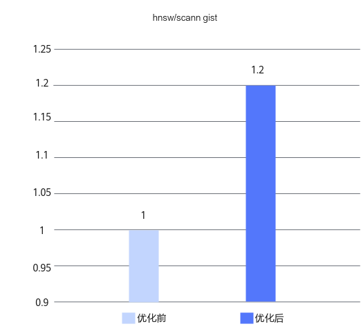

# Milvus向量指令优化 特性指南

## 特性介绍<a name="ZH-CN_TOPIC_0000002547526621"></a>

本文主要介绍Milvus数据库向量指令优化特性的优化原理和安装使用方法。

Milvus是业界领先的一种高性能、高扩展性的向量数据库，它提供强大的数据建模功能。在Milvus上使用HNSW算法或者ScaNN算法对数据集GIST进行测试时发现，两个向量之间求相似度的热点函数占CPU近90%的比重，如果能够对相应热点函数进行优化，可以取得明显的加速效果。而这种存在大量循环和简单数学运算的操作，使用SVE指令和PF进行加速是非常好用的手段。

- SVE（Scalable Vector Extension，可伸缩向量扩展）是由ARM公司开发的一种指令集扩展，旨在通过向量化技术提升计算密集型应用的性能。与NEON指令集不同，SVE具备可扩展性，即向量寄存器的长度可以根据需要进行扩展，而不受固定长度的限制。SVE还引入了矢量谓词操作，允许在同一个向量操作中对部分元素进行计算。这种灵活性提高了代码的可移植性和效率。
- PF（Prefetch，预取）是一种用于优化计算机系统性能的技术，主要用于减少处理器在等待内存数据时的空闲时间。通过提前加载数据到缓存中，预取技术可以显著减少内存访问的延迟，提高系统的整体性能。

Milvus数据库向量指令优化特性通过SVE+PF优化，实现在16U64G规格上，Milvus-hnsw算法在ann-benchmarks Gist数据集且recall值在0.99以上场景，QPS（Queries Per Second，每秒查询数）性能可获得20%提升；Milvus-scann算法在ann-benchmarks Gist数据集且recall值在0.95以上场景，QPS性能可获得20%提升。

## 环境要求<a name="ZH-CN_TOPIC_0000002516126710"></a>

本文基于鲲鹏服务器和openEuler操作系统提供指导，在正式操作前请确保软硬件均满足要求。


**表 1** 硬件要求<a id="硬件要求"></a>

|项目|规格|
|--|--|
|CPU|鲲鹏920新型号处理器|


**表 2** 操作系统和软件要求<a id="操作系统和软件要求"></a>

|项目|版本|获取地址|
|--|--|--|
|操作系统|openEuler 22.03 LTS SP3|[获取链接](https://www.openeuler.org/zh/download/archive/detail/?version=openEuler%252022.03%2520LTS%2520SP3)|
|操作系统|openEuler 22.03 LTS SP4|[获取链接](https://www.openeuler.org/zh/download/archive/detail/?version=openEuler%252022.03%2520LTS%2520SP4)|
|Milvus|2.4.5|[获取链接](https://gitee.com/milvus-io/milvus/)|
|GCC|10.3.1|openEuler 22.03 LTS SP3和openEuler 22.03 LTS SP4版本自带。|
|patch文件|0001-hnsw-scann-sve-pf.patch|[获取链接](https://gitee.com/kunpeng_compute/milvus/releases/download/KunpengBoostKit25.0.RC1.hnsw_scann_sve_pf/0001-hnsw-scann-sve-pf.patch)|


## 安装前配置<a name="ZH-CN_TOPIC_0000002515966788" id="安装前配置"></a>

以上描述的优化特性，都已经写入到patch文件中，对源码应用patch文件之后，就可以使能该特性。

**利用SVE加速向量运算<a name="section69055571702"></a>**

**预置条件**

CPU支持SVE指令优化。

**查看方式**

通过以下命令查看CPU是否支持SVE指令优化。

```
lscpu
```

回显结果中Flags行包含SVE，表示CPU支持SVE指令优化。

```
Architecture:           aarch64
  CPU op-mode(s):       64-bit
  Byte Order:           Little Endian
CPU(s):                 320
  On-line CPU(s) list:  0-319
Vendor ID:              HiSilicon
  BIOS Vendor ID:       HiSilicon
  BIOS Model name:      Kunpeng 920 7285Z
  Model:                0
  Thread(s) per core:   2
  Core(s) per socket:   80
  Socket(s):            2
  Stepping:             0x0
  Frequency boost:      disabled
  CPU max MHz:          3000.0000
  CPU min MHz:          400.0000
  BogoMIPS:             200.00
  Flags:                fp asimd evtstrm aes pmull sha1 sha2 crc32 atomics fphp asimdhp cpuid asimdrdm jscvt fcma lrcpc dcpop sha3 sm3 sm4 asimddp sha512 sve asimdfhm dit uscat ilrcpc fla
                        gm ssbs sb paca pacg dcpodp flagm2 frint svei8mm svef32mm svef64mm svebf16 i8mm bf16 dgh rng ecv
Caches (sum of all):
  L1d:                  10 MiB (160 instances)
  L1i:                  10 MiB (160 instances)
  L2:                   200 MiB (160 instances)
  L3:                   280 MiB (4 instances)
```

**编译选项**

GCC编译时，通过“-march”编译选项指定ARM架构版本以及扩展指令集。本特性patch中通过以下编译选项使用SVE：

```
-march=armv8-a+sve -msve-vector-bits=256
```

前者表示使用SVE指令集，后者指定SVE可变向量长度的位数。

**利用PF加速数据处理<a name="section1820132215314"></a>**

在频繁进行循环操作、并行计算、缓存未命中率较高等情况下，使用PF（预取）可以加速数据处理，提高系统性能。

**硬件预取**

硬件预取是通过跟踪指令和数据地址的变化，将指令和地址提前读到Cache里。建议在BIOS中将预取功能开启。

1. 重启服务器，进入BIOS设置界面。
2. 在BIOS中，选择“Advanced\>MISC Config”，按“Enter”键进入。
3. 将“CPU Prefetching Configuration”设置为“Enabled”，按“F10”键保存退出。

**软件预取**

在ARM架构中，可以使用PRFM（Prefetch Memory）指令来实现数据预取。预取指令会将数据加载到缓存中，但不会立即被处理器使用。预取的数据通常会放入L1数据缓存中。如果L1缓存已满，数据可能会被放入L2缓存或L3缓存（如果存在）。除此之外，还可以通过调整预取步长来进一步优化预取效果。

以下是预取指令在C++中的实现。

```
#define PLDL1KEEP_OFF(ptr, off) __asm__ volatile("prfm PLDL1KEEP, [%0, #(%1)]"::"r"(ptr), "i"(off):)
```

在本特性中，预取指令会加入到SVE加载指令之前以结合使用两个优化特性。


## 安装和使用特性<a name="ZH-CN_TOPIC_0000002547526623"></a>

针对Milvus数据库的加速特性主要应用于HNSW和ScaNN两个索引算法，优化特性以补丁文件形式提供。需要在编译Milvus后，在Knowhere源码中应用该补丁文件，之后再次进行编译，即可使用优化特性。该补丁文件针对Milvus 2.4.5版本进行开发。

> **说明：** 
>开源Milvus源码不包括索引相关的组件Knowhere，需要在编译过程中拉取Knowhere的源码并进行对接。本次优化特性应用于索引查询，补丁文件会添加到Knowhere源码中。所以整体使用过程需要编译Milvus两次，一次编译拉取Knowhere的源码，在合入patch文件后进行第二次编译，用来使能优化特性。
>此外，建议预先开启BIOS预取功能，可结合patch文件中软件预取，通过修改预取步长，使性能获得更好的提升。具体操作参见[安装前配置](#安装前配置)。

1. 下载Milvus安装包，放在主目录下“\~”，参见《[Milvus数据库 安装指南](https://www.hikunpeng.com/document/detail/zh/kunpengdbs/ecosystemEnable/Milvus/kunpeng_milv_ins_42_001.html)》完成Milvus的编译安装。

    获取路径请参见[**表 2** 操作系统和软件要求](#操作系统和软件要求) 。

2. 获取加速优化特性的补丁文件0001-hnsw-scann-sve-pf.patch，将其上传到主目录下。

    获取路径请参见[**表 2** 操作系统和软件要求](#操作系统和软件要求) 。

3. 进入安装目录下的“./cmake\_build/thirdparty/knowhere/knowhere-src”目录，并执行以下命令，合入加速优化特性。没有输出则说明合入成功。

    ```
    cd cmake_build/thirdparty/knowhere/knowhere-src
    git apply --whitespace=nowarn < ~/0001-hnsw-scann-sve-pf.patch
    ```

4. “./cmake\_build/thirdparty/knowhere/knowhere-build”目录下，执行以下命令编译Knowhere组件，使用优化特性。

    ```
    cd ../knowhere-build
    make -sj
    cp -r ../../../lib/libknowhere.so ../../../../internal/core/output/lib64/
    ```

5. 执行以下命令，确认是否使能加速特性。

    ```
    strings ~/milvus/internal/core/output/lib64/libknowhere.so | grep sve
    ```

    若返回SVE相关信息，表示加速特性使能成功。

    ```
    GNU C++17 10.3.1 -march=armv8-a+sve -mlittle-endian -mabi=lp64 -g -O3 -O3 -std=gnu++17 -std=gnu++17 -std=gnu++17 -fopenmp -fPIC
    ```

6. 通过ann-benchmarks gist数据集进行测试，可以得到使用加速优化特性前后的性能提升效果，如[**图 1** 优化特性使能前后性能对比](#优化特性使能前后性能对比)所示。即使能Milvus向量指令优化特性后，可以将Milvus查询性能（QPS）提升20%。详细测试步骤请参见《[Milvus数据库ann-benchmarks 测试指导](https://www.hikunpeng.com/document/detail/zh/kunpengdbs/testguide/tstg/kunpeng_ann_marks_001.html)》。

    **图 1** 优化特性使能前后性能对比<a name="fig78861413814"></a><a id="优化特性使能前后性能对比"></a><br>
    


## 缩略语<a name="ZH-CN_TOPIC_0000002515966786"></a>

|缩略语|英文全称|中文全称|
|--|--|--|
|SVE|Scalable Vector Extension|可扩展向量扩展|
|NEON|Advanced SIMD (Single Instruction Multiple Data)|高级单指令多数据流|
|PF|Prefetching|预取|
|QPS|Queries Per Second|每秒查询率|


